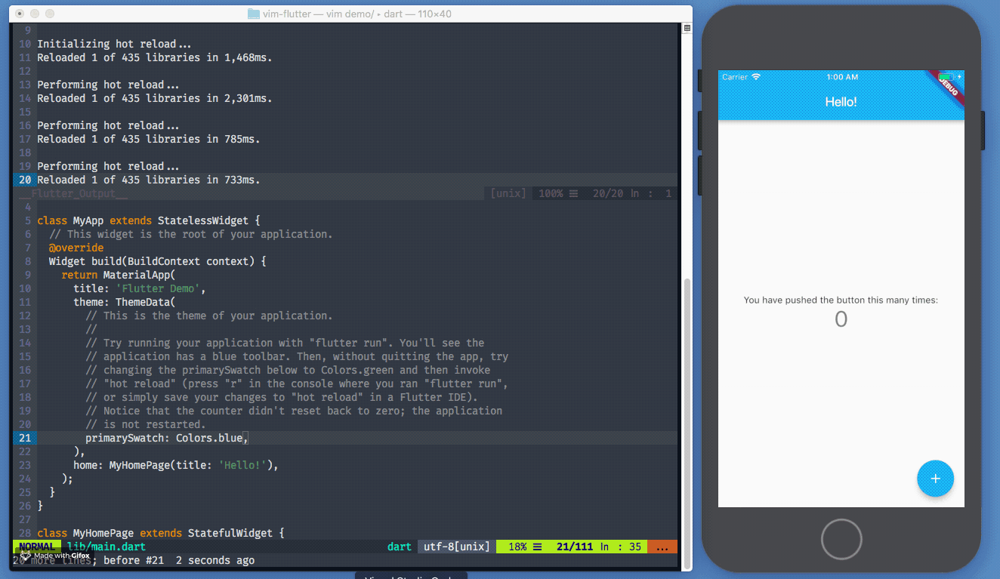

# vim-flutter
Vim commands for Flutter, including hot-reload-on-save and more.



## Usage
Usage documentation can be found both in this README, as well
as via calling `:h flutter`.

## Installation
`vim-flutter` is a Vimscript-only plugin, and makes heavy
use of Vim8's async jobs. It can be installed with a
package manager like
[`vim-plug`](https://github.com/junegunn/vim-plug)
, for example.

Though this package doesn't depend on it, having
[`dart-vim-plugin`](https://github.com/dart-lang/dart-vim-plugin)
available is recommended, for a better experience.

You may also consider combining
[`package:dart_language_server`](https://github.com/natebosch/dart_language_server)
with a Language Server Protocol client, like
[`ale`](https://github.com/w0rp/ale).

```vim
Plug 'dart-lang/dart-vim-plugin'
Plug 'thosakwe/vim-flutter'

" Run :PlugInstall to install the plugin.
```

Ultimately, installation is up to you.

## Options
* `g:flutter_command` - The Flutter executable path/name; defaults to `'flutter'`.
* `g:flutter_hot_reload_on_save` - Whether to auto hot-reload when `dart` files
are saved; defaults to `1`.
* `g:flutter_hot_restart_on_save` - Whether to auto hot-restart when `dart` files
are saved; defaults to `0`.
* `g:flutter_show_log_on_run` - Automatically open `__Flutter_Output__` when starting
flutter using `:FlutterRun`; it can have one of the following values:
  * `"split"` or `1`: Open the log in a split, this is the default.
  * `"tab"`: Open the log in a new tab.
  * `"hidden"` or `0`: Do not open the log by default, can be opened later with `FlutterSplit` etc.
* `g:flutter_show_log_on_attach` - Identical to `g:flutter_show_log_on_run` but affecting
the `:FlutterAttach` command.
* `g:flutter_split_height` - Initial height of the window opened by `:FlutterSplit` (or `:FlutterRun` and
  `:FlutterAttach`, when `g:flutter_show_log_on_run` is set to `"split"`); defaults to standard vim behavior,
  which is splitting the window in half.
* `g:flutter_autoscroll` - Autoscroll the flutter log when `1`, defaults to `0`.
* `g:flutter_use_last_run_option` - When set to `1` then `:FlutterRun` will use the arguments from
the previous call when no arguments are specified.
* `g:flutter_use_last_attach_option` - Identical to `g:flutter_use_last_run_option` but
affecting the `:FlutterAttach` command.
* `g:flutter_close_on_quit` - Whether to close all `__Flutter_Output__` windows (splits and tabs) on `:FlutterQuit`;
defaults to `0`.

## Provided Commands
* `:FlutterRun <args>` - calls `flutter run <args>`
* `:FlutterAttach <args>` - calls `flutter attach <args>`
* `:FlutterHotReload` - triggers a hot reload on the current Flutter process
* `:FlutterHotRestart` - triggers a hot restart on the current Flutter process
* `:FlutterScreenshot` - takes a screenshot of the current Flutter application and saves it in the project directory
* `:FlutterQuit` - quits the current Flutter process
* `:FlutterDevices` - opens a new buffer, and writes the output of `flutter devices` to it
* `:FlutterSplit` - opens Flutter output in a horizontal split
* `:FlutterEmulators` - Executes a `flutter emulators` process.
* `:FlutterEmulatorsLaunch` - Executes a `flutter emulators --launch` process, with any provided
arguments.
* `:FlutterVisualDebug` - Toggles visual debugging in the running Flutter process.

The following are self-explanatory:
* `:FlutterVSplit`
* `:FlutterTab`

## Menu Support
If you are using a GUI Vim Variant, you can add a `Flutter` menu by calling `call FlutterMenu()`.

## Hot Reload on Save
A convenient feature to have when working with Flutter is
to automatically hot-reload an app once a file is saved.
By default, whenever a `dart` file is saved, *if and only if*
a Flutter process is running, it will be hot-reloaded.

You can disable this by setting `g:hot_reload_on_save=0`,
*before* `vim-flutter` is loaded.

## Example `.vimrc`
```vim
Plug 'thosakwe/vim-flutter'
call plug#end()

" Enable Flutter menu
call FlutterMenu()

" Some of these key choices were arbitrary;
" it's just an example.
nnoremap <leader>fa :FlutterRun<cr>
nnoremap <leader>fq :FlutterQuit<cr>
nnoremap <leader>fr :FlutterHotReload<cr>
nnoremap <leader>fR :FlutterHotRestart<cr>
nnoremap <leader>fD :FlutterVisualDebug<cr>
```
